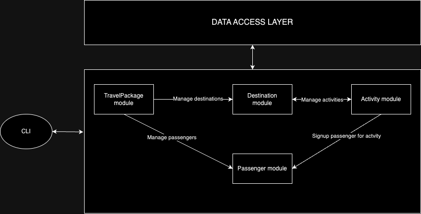

# Booking Management system

## Description

This is a booking management system that allows users to book travel packages

### Features
- Every travel package has a name, capacity, destinations, and a list of available passengers
- Every destination has list of activities and every activity is associated to only 1 destination
- Passengers can book an activity, provided that they're part of the corresponding travel package associated to the destination of the activity
- There are 3 types of passengers (Signified by the enum type)
  - STANDARD (No discount)
  - GOLD (10% discount)
  - PREMIUM (100% discount)
## HLD

## Use case Diagram

## Class Diagram

## Design Pointers

- The system follows SOLID design principles
  - Single Responsibility Principle
    - Example: The ActivityImpl class is only responsible for managing the activities of the user. ActivityService is
      defined on top of ActivityImpl to provide the business logic related to adding passengers to activity and so on
  - Open/Closed Principle
    - Example: The system is open for extension but closed for modification. For example, if we want to add a new type
      of
      passenger, we can do so by adding a new enum type and modifying the discount logic in the Passenger class
  - Liskov Substitution Principle
    - Example: Inheritance is not explicitly used in the code but the system is designed in such a way that the
      PassengerImpl class can be replaced by any other class that implements the Passenger interface
  - Dependency Inversion Principle
    - Example: The system is designed in such a way that the high-level modules are not dependent on the low-level
      modules.
      For example, the DestinationImpl class is not dependent on the ActivityImpl class. Instead, the DestinationImpl
      class is dependent on IActivity interface. DIY is used predominantly in the code because of which the classes are loosely coupled